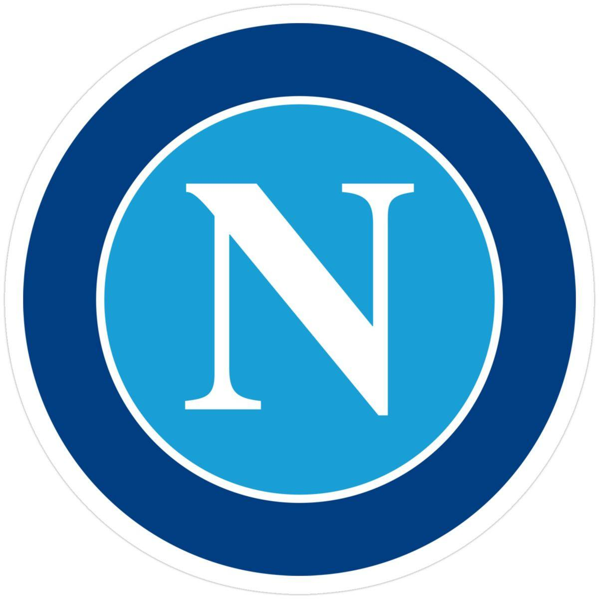
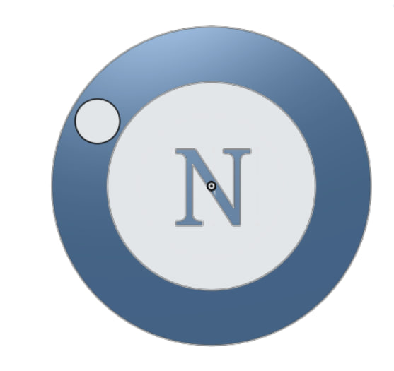

# SSC Napoli Logo – Onshape

## Project Overview

This project recreates the official SSC Napoli logo as a 3D model using Onshape. The design was created by tracing the original logo, creating the circular shapes, adding the letter N, and applying extrusion features to build the final 3D model.

The completed model was exported as an STL file, making it suitable for 3D printing.

---

## Original Logo

The original SSC Napoli logo used as a reference during the design process.

---

## Final Onshape Design

The completed 3D model designed in Onshape.

---

## Design Process

- Selected the original SSC Napoli logo as a reference.
- Created the outer and inner circles using Sketch.
- Added the N letter with the Text tool.
- Applied Extrude to create the 3D model.
- Adjusted the colors to match the original logo.
- Exported the final model as an STL file.

---

## Comparison

| Original Logo | Final Onshape Model |
|---------------|---------------------|
|  |  |

---

## Software Used

- Onshape
- GitHub

---

## Files Included

- README.md – Project documentation.
- Napoli_Logo.stl – Exported STL file ready for 3D printing.
- screenshots/NapoliLogo.jpg – Original logo reference.
- screenshots/OnshapeLogo.jpg – Final 3D model created in Onshape.

---

## STL File

The repository includes an exported STL file that can be used in slicing software or for 3D printing.

---

## Onshape Design Link

Paste your Onshape project link here:
https://your-onshape-link

---

## Repository Structure
Designing-a-Logo-model-Onshape/
│
├── README.md
├── Napoli_Logo.stl
│
└── screenshots/
    ├── NapoliLogo.jpg
    └── OnshapeLogo.jpg

---

## Author

Name:
